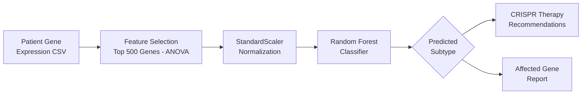

# 🧬 Personalized CRISPR Therapy Recommendation System

A machine learning pipeline that classifies **breast cancer subtypes** from gene expression data and recommends **CRISPR-based gene therapies** (CRISPRi / CRISPRa) tailored to each subtype.

---

## 📌 Overview

Breast cancer is a heterogeneous disease with molecularly distinct subtypes that respond differently to treatment. This project:

1. **Classifies** patient gene expression profiles into one of **6 breast cancer subtypes** using a Random Forest model trained on 54,675 gene features.
2. **Recommends** targeted CRISPR gene-editing strategies — suppressing oncogenes via **CRISPRi** or reactivating tumor suppressors via **CRISPRa**.

### Architecture



---

## 🏗️ Project Structure

```
├── README.md                 # Project documentation
├── requirements.txt          # Python dependencies
├── .gitignore                # Git ignore rules
├── config.py                 # Hyperparameters & gene therapy mappings
├── train.py                  # Model training pipeline
├── app.py                    # Streamlit web application
├── utils.py                  # Shared utility functions
└── generate_test_data.py     # Synthetic test data generator
```

---

## 🔬 Cancer Subtypes & CRISPR Strategies

| Subtype | Key Genes | CRISPR Strategy |
|---------|-----------|-----------------|
| **HER2+** | ERBB2, GRB7, PIK3CA | CRISPRi (suppress overexpressed HER2 pathway) |
| **Luminal A** | ESR1, PGR, GATA3 | CRISPRi (suppress hormone receptors) |
| **Luminal B** | CCND1, FOXA1, MYB | CRISPRi (suppress cell-cycle drivers) |
| **Basal-like** | TP53, EGFR, BRCA1 | CRISPRa (reactivate tumor suppressors) |
| **Normal-like** | GATA3, BRCA1, FOXA1 | CRISPRa (boost protective genes) |
| **Cell Line** | MYC, TERT, CDK4 | CRISPRi (suppress proliferation drivers) |

---

## ⚙️ Setup & Installation

### Prerequisites

- Python 3.9+
- pip

### Install Dependencies

```bash
pip install -r requirements.txt
```

### Download Dataset

The model is trained on the [Breast Cancer Gene Expression (CuMiDa)](https://www.kaggle.com/datasets/brunogrisci/breast-cancer-gene-expression-cumida) dataset from Kaggle.

```bash
# Option 1: Using kagglehub
python -c "import kagglehub; kagglehub.dataset_download('brunogrisci/breast-cancer-gene-expression-cumida')"

# Option 2: Manual download from Kaggle and place Breast_GSE45827.csv in the project root
```

---

## 🚀 Usage

### 1. Train the Model

```bash
python train.py --data Breast_GSE45827.csv
```

This will:
- Load and preprocess the gene expression dataset
- Balance classes using SMOTE oversampling
- Select the top 500 most discriminative genes (ANOVA F-test)
- Train a Random Forest classifier (300 trees)
- Train a specialized Basal vs Luminal-B model
- Save all model artifacts (`.pkl` files) to `models/`
- Print evaluation metrics (accuracy, classification report, cross-validation scores)

### 2. Launch the Web App

```bash
streamlit run app.py
```

Then open `http://localhost:8501` in your browser. Upload a patient gene expression CSV to get:
- Predicted cancer subtype
- Affected genes table
- CRISPR therapy recommendations (CRISPRi or CRISPRa)

### 3. Generate Test Data (Optional)

```bash
python generate_test_data.py
```

Creates a synthetic `test_patient_data.csv` with the correct 500-feature schema for testing the app.

---

## 📊 Model Performance

| Metric | Score |
|--------|-------|
| **Test Accuracy** | 94.0% |
| **CV Mean Accuracy (5-fold)** | 95.9% ± 2.1% |
| **Features (before selection)** | 54,675 |
| **Features (after selection)** | 500 |

### Per-Class Performance

| Subtype | Precision | Recall | F1-Score |
|---------|-----------|--------|----------|
| HER2+ | 0.89 | 1.00 | 0.94 |
| Basal | 1.00 | 0.88 | 0.93 |
| Cell Line | 1.00 | 1.00 | 1.00 |
| Luminal A | 0.82 | 1.00 | 0.90 |
| Luminal B | 1.00 | 0.78 | 0.88 |
| Normal | 1.00 | 1.00 | 1.00 |

---

## 🧪 How CRISPR Gene Editing Works

- **CRISPRi (CRISPR Interference):** Uses a modified dCas9-KRAB protein to block transcription of target oncogenes, effectively silencing them.
- **CRISPRa (CRISPR Activation):** Uses dCas9-VP64 to boost transcription of tumor suppressor genes that help prevent cancer.
- **Guide RNA (gRNA):** A small RNA sequence that directs the CRISPR machinery to the specific gene of interest.

---

## 🛠️ Tech Stack

- **ML**: scikit-learn, imbalanced-learn (SMOTE)
- **Data**: pandas, NumPy
- **App**: Streamlit
- **Visualization**: matplotlib

---

## 📄 License

This project is licensed under the MIT License. See [LICENSE](LICENSE) for details.

---

## 🙏 Acknowledgments

- Dataset: [Breast Cancer Gene Expression Profiles (CuMiDa)](https://www.kaggle.com/datasets/brunogrisci/breast-cancer-gene-expression-cumida) — Grisci et al.
- CRISPR therapy concepts based on published literature on CRISPRi/CRISPRa applications in oncology.
